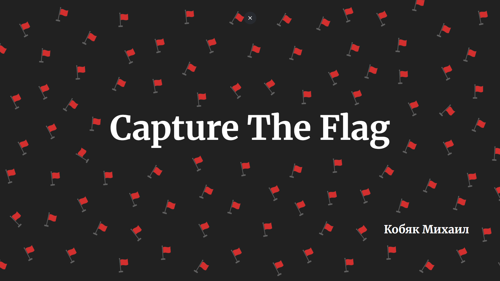

# Введение в CTF

Репозиторий с вводными ctf-заданиями

### Задания

| Категория | Название таска                                           | На что задание                         |
|-----------|----------------------------------------------------------|----------------------------------------|
| crypto    | **[encoding](tasks/encoding/)**                          | Кодировка bas64                        |
| crypto    | **[hash](tasks/hash/)**                                  | MD5-хэш                                |
| crypto    | **[cypher](tasks/cypher/)**                              | Шифр Цезаря                            |
| web       | **[html](tasks/html/)**                                  | Разбираемся с HTTP                     |
| web       | **[iDoor](tasks/iDoor/)**                                | IDOR                                   |
| forensics | **[dump](tasks/dump/)**                                  | Дамп сетевого трафика                  |
| reverse   | **[compiled](tasks/compiled/)**                          | IDA                                    |
| pwn       | **[stack](tasks/stack/)**                                | Stack Based Buffer Overflow            |